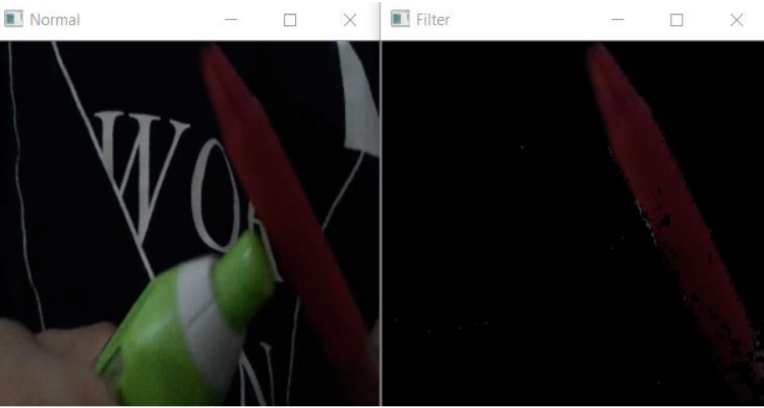

# Color Detector Using Computer Vision
A color detector program, written in Python, made using computer vision

Requirements:
1) Android installed with IP Camera

2) Python 3.x with:
•Computer vision library
•Requests library
•Numpy library
